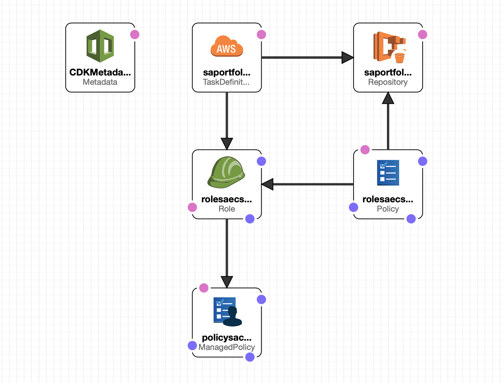

# Stock Advisor System

This project is the starting point for the Stock Advisor system. Here you can find its documentation and also the Cloudformation templates (based on CDK) used to get the system up and running.

The system is organized into different GitHut projects

|Project Name|Project URL|Description|
|---|---|---|
|Stock Advisor Main Project|https://github.com/hanegraaff/stock-advisor-main-project|This starting point for this proct. Contains documentation and automation scripts.|
|Recommendation Service|https://github.com/hanegraaff/sa-recommendation-service|Project containing the recommendation service software|
|Portfolio Manager|TBD|Project containing the Portfolio Manager software|

# Project status
The project is currently under development.

 # Overview


Stock Advisor is an algorithmic trading system that can trade on your behalf using your brokerage account. It tracks an evolving portfolio of US securities based on market sentiment and actively trades it.

The system is written in Python and runs in AWS, using a serverless platform. It relies on an external source for its finiancial data as well as an existing online brokerage platform to execute trades. Financial data is provided by **Intrinio** (www.intrinio.com), while brokerage services are provided using the **Etrade** developer platform (developer.etrade.com).

Broadly speaking, the system is organzined in two services. †he first is a recommendation service that selects a monthly pool of US Equity stocks that it predicts will outperform the market, and the second is a portfolio manager that makes realtime trading decisions based on it.

## Recommendation System
**Status: Initial Development Complete**

This component maintains a monthly list of US equities using a market sentiment based algorithm based on analyst target price consensus and stores the results in S3. It runs inside a docker container hosted by AWS Fargate, and is scheduled to run at the end of each month, once all analyst target price predictions have been made available. It requires a list of ticker symbols stored that represents the universe of stocks that is to be analyzed. This list can contain any US Stocks and currently uses the DJIA As development progresses this list will be replaced with the S&P500, or other larger indexes. I also requires access to financial data, specifically pricing information and analyst forecasts. This infomation is downloaded and stored to S3 to reduce reliance in the Data APIs

## Portfolio Manager
**Status: Pending Development**

The portfolio manager is an AWS Lambda based service that monitors the performance of the stock pool created by the Recommendation System and maitains an active portfolio based in it. It's exact behavior it TBD


# Stock Advisor AWS Infrastructure
**Status: Initial Development Complete**

Stock Advisor's infrastructure is defined using a CDK based script, which exposes three stacks:

```
>>cdk ls
app-infra-base
app-infra-compute
app-infra-develop
```

Information on getting started with the CDK is available here:

https://docs.aws.amazon.com/cdk/latest/guide/getting_started.html


## app-infra-base stack


This stack creates the foundational resources which don't change often, and include:

1) A Public VPC spanning two subnets (no NAT)
2) S3 buckets to store application data and artifacts
3) ECS cluster compatible with Fargate.
4) A security group used by the ECS tasks.
5) IAM task role that define the AWS permissions allowed by the ECS tasks.

### Exports
|Export Name|Description|
|---|---|
|sa-data-bucket-name|S3 Data Bucket used by the application|
|sa-vpcid|VPC ID of the used by ECS tasks|
|sa-public-subnet-1|Public Subnet ID 1|
|sa-public-subnet-2|Public Subnet ID 1|

Additionally, there are automatically generated exports which are not documented here. These are used by the CDK to create dependencies between stacks


## app-infra-compute stack


This stack creates the application compute resources that are more prone to change and include:

1) ECR repository for the Recommendation Service Image
2) ECS Task definitions
3) ECS Execution IAM role. The role is maintained here since each new task definition will inject an additional policy into it.

### Exports
|Export Name|Description|
|---|---|
|sa-recommendation-service-repo-uri|Recommendation Service repository URI|

Additionally, there are automatically generated exports which are not documented here. These are used by the CDK to create dependencies between stacks
    
## app-infra-develop stack


Contains the application CICD's resources, namely the codebuild project used to build the Portfoli Selector docker image.


# Setting up and creating the system

## Prerequisites
1) Latest AWS CDK
2) Latest Python 3.x
3) An AWS account where resources can be deployed
4) Programmatic access to AWS credentials. These may include credentials stored in the AWS CLI configuration, or temporary credentials written to the environment variables.

## Create a virtual environment
```
$ python3 -m venv .env
```

After the init process completes and the virtualenv is created, you can use the following
step to activate your virtualenv.

```
$ source .env/bin/activate
```

If you are a Windows platform, you would activate the virtualenv like this:

```
% .env\Scripts\activate.bat
```

## Installing Dependencies
Once the virtualenv is activated, you can install the required dependencies.

```
$ pip install -r requirements.txt
```

To add additional dependencies, for example other CDK libraries, just add to
your requirements.txt file and rerun the `pip install -r requirements.txt`
command. Alternatively you may add those to ```setup.py```


## Creating/Destrying the application infrastructure

To create or update the application infrastructure you may rely on the ```cd deploy``` command

```
cdk deploy app-infra-base
cdk deploy app-infra-compute
cdk deploy app-infra-develop
```

To destroy it, use the ```cd destroy``` command

```
cdk destroy app-infra-base
cdk destroy app-infra-compute
cdk destroy app-infra-develop
```

To create the application infrastructure in a sigle command use:

```
cdk deploy app-infra-base app-infra-compute app-infra-develop
```

## Testing
CDK doesn't curently offer testing framework for Python, but a basic testing script can be executing using```pytest```.

Unit tests will be added a soon as CDK offers it.


## Useful commands

 * `cdk ls`          list all stacks in the app
 * `cdk synth`       emits the synthesized CloudFormation template
 * `cdk deploy`      deploy this stack to your default AWS account/region
 * `cdk diff`        compare deployed stack with current state
 * `cdk docs`        open CDK documentation

# Bulding and deploying the system
This section is currently under construction